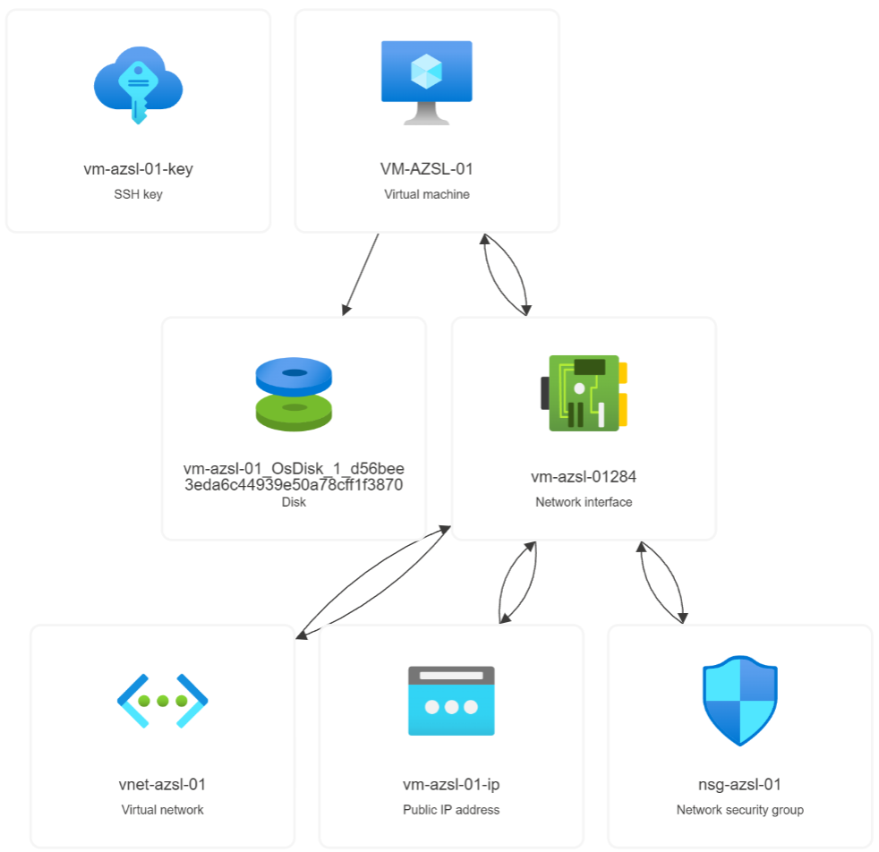

# Lab 01 — Azure Foundation & Resource Lifecycle

Status: **completed**

## Overview

This lab builds a practical mental model of how a basic Azure IaaS workload is organized, connected, inspected, observed, and managed through its lifecycle.

The environment was created in Microsoft Azure and inspected through:

- Azure Portal
- Azure CLI
- Azure Activity Log
- SSH to the Linux guest

The lab establishes the foundation for later work with compute administration, identity, networking, monitoring, storage, backup, and troubleshooting.

---

## Architecture



Verified workload model:

```text
Azure Subscription
└── Resource Group: rg-azsl-01
    ├── Virtual Machine: vm-azsl-01
    │   ├── NIC reference → vm-azsl-01284
    │   └── OS Disk reference → vm-azsl-01_OsDisk_1_...
    │
    ├── Network Interface: vm-azsl-01284
    │   ├── IP configuration: ipconfig1
    │   │   ├── Private IP
    │   │   ├── Subnet reference → subnet-azsl-01
    │   │   └── Public IP reference → vm-azsl-01-ip
    │   └── NSG association → nsg-azsl-01
    │
    ├── Virtual Network: vnet-azsl-01
    │   └── Subnet: subnet-azsl-01
    │
    ├── Network Security Group: nsg-azsl-01
    ├── Public IP: vm-azsl-01-ip
    ├── Managed OS Disk: vm-azsl-01_OsDisk_1_...
    └── SSH Key: vm-azsl-01-key
```

---

## Purpose

Build a reliable mental model of Azure resource hierarchy, resource dependencies, control-plane visibility, and resource lifecycle using one small Linux VM workload.

The goal was not only to create a VM, but to understand every supporting Azure object and how those objects relate to one another.

---

## Course coverage

Primary coverage:

- Course 7 — Cloud Computing Essentials with Azure Management

Introductory overlap:

- Course 8 — Azure Cloud Services

---

## Learning outcomes

By completing this lab, I practiced how to:

- Explain `Subscription → Resource Group → Resource`.
- Identify the Azure resources created around a basic VM.
- Explain how a VM depends on its NIC, subnet, VNet, NSG, Public IP, and managed disk.
- Distinguish top-level Azure resources from nested configuration objects.
- Inspect the same environment through Azure Portal and Azure CLI.
- Read and interpret a basic Azure Resource ID.
- Use Activity Log as control-plane evidence.
- Distinguish VM resource existence from VM runtime state.
- Reason about independent resource lifecycles and delete behavior.
- Observe how retained resources can continue to generate cost after VM deallocation.

---

## Resources created

```text
Resource Group
├── Virtual Network
│   └── Subnet
├── Network Security Group
├── Network Interface
├── Linux Virtual Machine
├── Managed OS Disk
├── Public IP
└── SSH Key
```

Key resource names:

```text
Resource Group: rg-azsl-01
VM:             vm-azsl-01
NIC:            vm-azsl-01284
VNet:           vnet-azsl-01
Subnet:         subnet-azsl-01
NSG:            nsg-azsl-01
Public IP:      vm-azsl-01-ip
SSH Key:        vm-azsl-01-key
```

---

## Execution flow

The lab was completed in seven phases:

```text
Prepare
  ↓
Build
  ↓
Inspect
  ↓
Map
  ↓
Observe
  ↓
Lifecycle
  ↓
Cleanup
```

Detailed notes:

- [`LAB01_PHASE1_PREPARE.md`](LAB01_PHASE1_PREPARE.md)
- [`LAB01_PHASE2_BUILD.md`](LAB01_PHASE2_BUILD.md)
- [`LAB01_PHASE3_INSPECT.md`](LAB01_PHASE3_INSPECT.md)
- [`LAB01_PHASE4_MAP.md`](LAB01_PHASE4_MAP.md)
- [`LAB01_PHASE5_OBSERVE.md`](LAB01_PHASE5_OBSERVE.md)
- [`LAB01_PHASE6_LIFECYCLE.md`](LAB01_PHASE6_LIFECYCLE.md)
- [`LAB01_PHASE7_CLEANUP.md`](LAB01_PHASE7_CLEANUP.md)

The working execution guide is available in [`EXECUTION.md`](EXECUTION.md).

---

## Key findings

### 1. A VM is only one part of the workload

Creating a VM resulted in multiple Azure resources with separate identities and lifecycles.

```text
VM
├── NIC
├── Managed OS Disk
└── network dependencies
```

### 2. The NIC is the central network attachment point

The VM does not directly own the VNet or private IP.

```text
VM
→ NIC
→ IP configuration
→ Subnet
→ VNet
```

The private IP belongs to the NIC IP configuration.

The Public IP is a separate Azure resource referenced by that configuration.

### 3. The subnet is not a top-level resource in the same sense as the VM

The subnet exists as configuration inside the VNet.

```text
VNet
└── Subnet
```

This was also reflected in the Resource Group inventory, where the subnet did not appear as a separate top-level row.

### 4. NSG filtering and guest services are different layers

The NSG controls the Azure network path.

It is not a firewall inside Ubuntu.

For SSH connectivity:

```text
Internet
→ Public IP
→ NIC
→ NSG
→ VM
→ Ubuntu SSH service
```

An NSG rule allowing TCP/22 does not guarantee that the SSH service inside the guest is healthy.

### 5. Portal and CLI expose the same control-plane resources

Azure CLI returned the same seven top-level resources previously identified in Azure Portal.

Example commands used:

```powershell
az group show --name rg-azsl-01 --output table

az resource list `
  --resource-group rg-azsl-01 `
  --output table

az vm show `
  --resource-group rg-azsl-01 `
  --name vm-azsl-01 `
  --show-details `
  --output table
```

This reinforced the model:

```text
Azure Portal
     ↓
Azure control plane
     ↑
Azure CLI
```

### 6. Provisioning state is not power state

The lab demonstrated:

```text
ProvisioningState: Succeeded
≠
PowerState: VM running
```

A resource can be successfully provisioned while the VM itself is stopped or deallocated.

### 7. Activity Log is control-plane evidence

A representative Activity Log event was:

```text
Operation: Start Virtual Machine
Status: Succeeded
Affected resource: vm-azsl-01
```

Activity Log was useful for identifying:

- what management operation occurred;
- when it happened;
- who initiated it;
- which resource was affected;
- whether Azure completed it successfully.

It does not replace Linux system logs, SSH authentication logs, or application logs.

### 8. Resource dependency does not mean shared lifecycle

The VM JSON showed different delete behavior for attached resources:

```text
OS disk deleteOption: Delete
NIC deleteOption:     Detach
```

This demonstrated that related Azure resources can have different lifecycle behavior.

### 9. Deallocation does not mean zero total cost

After the VM was stopped and deallocated, Cost Management still showed cost associated with retained resources such as:

```text
Managed OS Disk
Standard Public IP
```

The important conclusion was:

```text
VM deallocated
≠
all related Azure cost = zero
```

---

## Screenshots

Selected sanitized evidence:

- [`lab01-resource-inventory.png`](../../docs/screenshots/lab01-resource-inventory.png)
- [`lab01-rg-azsl-01.png`](../../docs/screenshots/lab01-rg-azsl-01.png)
- [`lab01-vnet-azsl-01_topology.png`](../../docs/screenshots/lab01-vnet-azsl-01_topology.png)
- [`lab01-nsg-azsl-01.png`](../../docs/screenshots/lab01-nsg-azsl-01.png)
- [`lab01-vm-azsl-01.png`](../../docs/screenshots/lab01-vm-azsl-01.png)
- [`lab01-vm-azsl-01-ip.png`](../../docs/screenshots/lab01-vm-azsl-01-ip.png)
- [`lab01-vm-azsl-01_OsDisk_1_xxx.png`](../../docs/screenshots/lab01-vm-azsl-01_OsDisk_1_xxx.png)

Sensitive values were removed or masked before repository use.

---

## Additional evidence

A sanitized annotated VM JSON example is stored in:

[`evidence/vm-azsl-01_annotated.jsonc`](evidence/vm-azsl-01_annotated.jsonc)

It documents the meaning of:

- Azure Resource ID
- provider namespace
- VM size
- image reference
- managed disk reference
- NIC reference
- SSH configuration
- security configuration
- delete options

---

## Lifecycle result

The lab environment was intentionally retained for immediate reuse by Lab 02.

Final state:

```text
Lab 01: completed
VM: Stopped (deallocated)
Base environment: retained for Lab 02
Full Resource Group deletion: deferred
```

Retained resources remain known, documented, and intentionally preserved.

---

## Support relevance

This lab reinforced several support habits that will be reused throughout the project:

- Build a resource inventory before troubleshooting.
- Understand dependencies before changing or deleting resources.
- Separate resource existence from runtime state.
- Use control-plane evidence instead of guessing.
- Correlate Portal, CLI, Activity Log, and guest-level observations.
- Verify the effect of every lifecycle change.
- Review cost across all retained resources, not only VM compute.

---

## Security and evidence policy

The repository does not store:

- passwords;
- SSH private keys;
- credentials;
- full subscription IDs;
- tenant-sensitive identifiers;
- billing data;
- raw private screenshots.

Public IP values and other sensitive identifiers are masked where they are not required for learning evidence.

---

## Completion status

```text
Prepare      ✓
Build        ✓
Inspect      ✓
Map          ✓
Observe      ✓
Lifecycle    ✓
Cleanup      ✓
```

Lab 01 is complete.

Next:

```text
Lab 02 — Azure Compute & Administration
```
